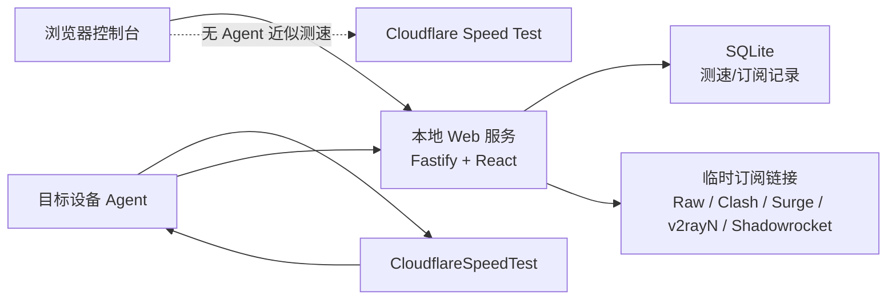

<div align="center">

# Cloudflare CDN 设备测速订阅

_一个本地部署的 Cloudflare 优选 IP 测速与临时订阅生成器_

<p>
  <a href="#license"></a>
  
  
  
  
  
  
</p>

<p>
  
  
  
  
  
</p>

<p>
  <a href="#功能特性">功能特性</a> ·
  <a href="#快速开始">快速开始</a> ·
  <a href="#使用流程">使用流程</a> ·
  <a href="#各平台使用">各平台使用</a> ·
  <a href="#badge-按钮怎么做">Badge 按钮</a>
</p>

</div>

## 项目定位

这个项目把 [XIU2/CloudflareSpeedTest](https://github.com/XIU2/CloudflareSpeedTest) 的测速结果和类似 [InfiCheesy/cloudflaresub](https://github.com/InfiCheesy/cloudflaresub) 的订阅改写思路整合成一个本地 Web 控制台。

它适合部署在局域网里的电脑、NAS、旁路由或小主机上，用来完成：

- 在目标设备上真实运行 CFST，得到该设备网络出口到 Cloudflare CDN 的优选 IP。
- 在 iOS 或临时设备上做无安装浏览器测速，用来判断当前访问体验。
- 把优选 IP 写入已有 `vmess`、`vless`、`trojan` 节点，生成临时订阅链接。
- 输出 Raw、Clash、Surge、v2rayN、Shadowrocket 五种格式，方便直接导入客户端。

> 注意：浏览器无 Agent 测速不能生成可靠优选 IP。需要自动优选 IP 时，请在目标设备运行 Agent，或手动填写已有优选地址。

## 功能特性

- **本地部署**：Node.js + Fastify + SQLite，数据默认保存在 `data/` 目录。
- **真实设备测速**：Windows、Linux、macOS、Android Termux 可运行 Agent，测速发生在 Agent 所在设备。
- **无 Agent 模式**：当前浏览器直接访问 Cloudflare Speed Test 端点，适合 iOS、访客设备和临时排查。
- **CFST 参数可调**：支持 IPv4/IPv6、端口、延迟线程、下载数量、下载时长、测速 URL。
- **临时订阅**：订阅链接默认 24 小时过期，可在页面调整为 1-168 小时。
- **多格式输出**：Raw、Clash、Surge、v2rayN、Shadowrocket。
- **Token 鉴权**：管理 Token、Agent Token、订阅 Token 分离，适合可信局域网使用。
- **PWA 支持**：手机浏览器可添加到主屏幕，作为本地控制台使用。

## 系统架构



## 快速开始

### 1. 安装依赖并启动 Web 服务

```bash
npm install
npm run build
npm start
```

启动后终端会打印管理 Token 和 Agent Token。浏览器打开：

```text
http://<部署电脑局域网IP>:8787
```

如果需要后台运行：

```bash
npm run serve:daemon
```

停止后台服务：

```bash
npm run stop
```

### 2. 启动 Agent

在需要真实测速的设备上安装 Node.js 20，进入项目目录后运行：

```bash
npm install
npm run cfst:install
npm run agent -- --server http://<部署电脑局域网IP>:8787 --token <AGENT_TOKEN> --name <设备名>
```

Agent 命令里的服务端地址不是写死的。页面会使用你当前访问网页的地址生成命令。跨设备连接时，请先用目标设备能访问到的局域网地址打开网页。

## 使用流程

### A. 使用 Agent 结果生成订阅

1. 在目标设备启动 Agent。
2. 网页进入「Agent优选IP」。
3. 选择在线设备，点击「开始真实优选」。
4. 测速完成后，在结果表里勾选要使用的优选 IP。
5. 进入「临时订阅」。
6. 粘贴原始节点文本，或填写远程订阅 URL。
7. 设置名称前缀、有效期、是否保留原始 Host/SNI。
8. 点击「生成临时订阅地址」。
9. 复制 Raw / Clash / Surge / v2rayN / Shadowrocket 链接到客户端。

服务端会把原始节点中的 `server` 地址替换为选中的优选 IP。如果开启「保留原始 Host/SNI」，原节点域名会写入 `host` / `sni`，用于保持 TLS 和 WebSocket 参数。

### B. 手动优选地址生成订阅

没有 Agent 结果时，也可以手动填写已有优选 IP：

```text
1.1.1.1:443#home
2.2.2.2:443#backup
[2606:4700::]:443#ipv6
```

然后进入「临时订阅」，粘贴节点文本或填写订阅 URL，点击生成即可。

### C. 无 Agent 浏览器测速

「无Agent测速」会从当前浏览器访问 Cloudflare Speed Test 端点，测量延迟、下载和上传体验。

适合：

- iPhone / iPad 上临时判断当前网络体验。
- 不想安装 Agent 的设备。
- 快速确认某个 Wi-Fi 或蜂窝网络访问 Cloudflare 是否正常。

不适合：

- 枚举 Cloudflare 候选 IP。
- 指定 IP 并手动设置 Host/SNI。
- 自动产出可替换到代理节点里的优选 IP。

## 各平台使用

### Windows 10/11

使用 PowerShell：

```powershell
cd C:\cloudflare-cdn-sub
npm install
npm run cfst:install
npm run agent -- --server http://<服务端IP>:8787 --token <AGENT_TOKEN> --name Windows-PC
```

如果 Windows 同时作为 Web 服务端：

```powershell
npm install
npm run build
npm run serve:daemon
```

如果局域网设备打不开网页，检查 Windows 防火墙是否允许 Node.js 监听专用网络。

### Linux / NAS / 旁路由

```bash
cd /opt/cloudflare-cdn-sub
npm install
npm run cfst:install
npm run agent -- --server http://<服务端IP>:8787 --token <AGENT_TOKEN> --name Linux-PC
```

作为 Web 服务端：

```bash
npm run build
npm run serve:daemon
tail -f data/server.log
```

### macOS

```bash
cd ~/cloudflare-cdn-sub
npm install
npm run cfst:install
npm run agent -- --server http://<服务端IP>:8787 --token <AGENT_TOKEN> --name MacBook
```

如果系统拦截 CFST 二进制：

```bash
chmod +x vendor/cfst/current/cfst
xattr -d com.apple.quarantine vendor/cfst/current/cfst 2>/dev/null || true
```

### Android Termux

```bash
pkg update
pkg install nodejs git tar unzip
cd ~/cloudflare-cdn-sub
npm install
npm run cfst:install
npm run agent -- --server http://<服务端IP>:8787 --token <AGENT_TOKEN> --name Android-Phone
```

### iOS / iPadOS

iOS 不能直接运行当前 Linux/Node/CFST Agent。推荐用法：

1. Safari 打开 `http://<服务端IP>:8787`。
2. 使用「无Agent测速」查看 iPhone 当前访问 Cloudflare 的体验。
3. 如需生成优选 IP 订阅，请使用路由器、旁路由、NAS 或电脑上的 Agent 结果，或手动填写已有优选 IP。
4. Safari 可通过分享菜单添加到主屏幕。

## 配置

可复制 `.env.example` 并按需设置环境变量：

```env
APP_HOST=0.0.0.0
APP_PORT=8787
APP_TOKEN=
AGENT_TOKEN=
DATA_DIR=/opt/cloudflare-cdn-sub/data
CFST_VERSION=v2.3.5
```

如果不手动设置 Token，首次启动会自动生成并保存到 `data/secrets.json`。

## API 概览

| 方法 | 路径 | 用途 |
| --- | --- | --- |
| `GET` | `/api/me` | 当前服务信息和 Agent 启动命令 |
| `GET` | `/api/agents` | 查看已连接 Agent |
| `POST` | `/api/agents/:id/speedtests` | 在指定 Agent 上启动 CFST |
| `GET` | `/api/speedtests/:id/events` | 读取测速日志和状态事件 |
| `GET` | `/api/speedtests/:id` | 查看测速结果 |
| `POST` | `/api/subscriptions` | 生成临时订阅 |
| `GET` | `/sub/:id?target=raw\|clash\|surge\|v2rayn\|shadowrocket&token=...` | 拉取订阅内容 |

## Badge 按钮怎么做

README 顶部那些“按钮”不是 GitHub 的特殊组件，而是普通图片。最常用的服务是 [shields.io](https://shields.io/)，它会根据 URL 动态生成 SVG 徽章。

最简单的格式：

```md

```

对应规则：

```text
https://img.shields.io/badge/<左侧文字>-<右侧文字>-<颜色>?style=flat-square
```

带图标的写法：

```md

```

居中并排显示时，用 HTML 更好控制：

```html
<p align="center">
  
  
  
</p>
```

让徽章可以点击时，在外层包一层链接：

```html
<a href="https://github.com/XIU2/CloudflareSpeedTest">
  
</a>
```

常用参数：

- `style=flat-square`：方形扁平风格，和你给的参考图一致。
- `logo=windows`：使用 Simple Icons 图标名。
- `logoColor=white`：图标颜色。
- `%20`：空格，例如 `Node.js%2020`。
- `%7C`：竖线 `|`，例如 `Raw%20%7C%20Clash`。

颜色可以用英文或十六进制：

```text
brightgreen
blue
orange
111111
f38020
8b5cf6
```

## 项目结构

```text
.
├── src
│   ├── agent          # 设备侧 Agent
│   ├── server         # Fastify API、WebSocket、SQLite
│   └── shared         # CFST 参数、CSV 解析、订阅转换
├── web                # React 前端
├── scripts            # CFST 安装、后台启动/停止
├── tests              # 单元测试
└── data               # 本地数据库、Token、日志
```

## 注意事项

- 本项目默认面向可信局域网使用，不建议直接暴露到公网。
- 真实优选 IP 测速发生在 Agent 所在设备，不是 Web 服务所在电脑。
- 无 Agent 浏览器测速发生在当前浏览器设备，但不会产出优选 IP。
- 订阅地址是临时链接，默认 24 小时过期。
- CFST 默认下载 `v2.3.5`，可通过 `CFST_VERSION` 覆盖。

## 致谢

- [XIU2/CloudflareSpeedTest](https://github.com/XIU2/CloudflareSpeedTest)
- [InfiCheesy/cloudflaresub](https://github.com/InfiCheesy/cloudflaresub)
- [shields.io](https://shields.io/)

## License

MIT
